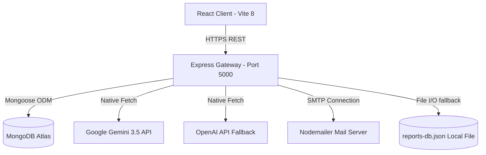
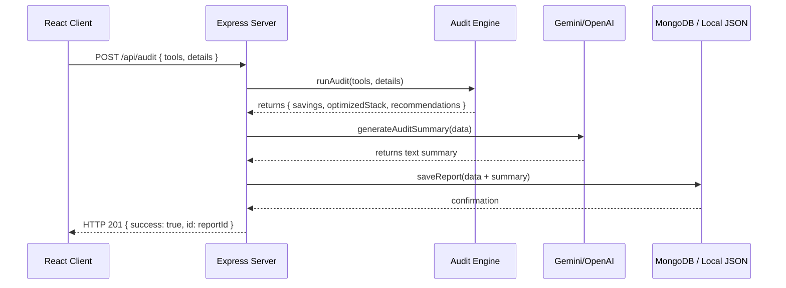

# StackAudit System Architecture 🏗️

This document describes the high-level architecture, database schemas, processing pipelines, security layers, and scalability targets of the StackAudit SaaS application.

---

## 🗺️ High-Level System Architecture

StackAudit is built using a decoupled Client-Server architecture. The React frontend interacts with the Express backend using secure HTTP REST endpoints.



---

## 🎨 Frontend Architecture

The frontend is built using **React 19** and bundled using **Vite 8**. It is fully decoupled from the backend and can be hosted statically (e.g. Vercel, Netlify, Cloudflare Pages).

### Key Architectural Concepts
1. **Dynamic Service Wrapper (`src/services/api.js`)**: Encapsulates all AJAX communications. Drives requests using a configurable base URL (`VITE_API_URL`) to allow seamless switching between local development ports and cloud-hosted backends.
2. **Local Storage Synchronization**: Used in the `MultiStepForm` to persist state across steps so that users don't lose data if they refresh mid-audit.
3. **Optimized Print CSS**: We utilize media query overrides (`@media print`) instead of heavy PDF rendering libraries (like `jspdf` or `pdfmake`). The browser's native print engine converts the DOM structure directly into an A4 vector layout, maximizing readability and minimizing bundle sizes.

---

## ⚙️ Backend Architecture

The backend is a Node.js Express server structured around MVC-style routes, controllers, and services.

### Key Abstractions
- **Audit Engine (`server/src/utils/auditEngine.js`)**: A deterministic rule engine that parses client inputs, maps them against pricing tables, and calculates cost-efficiency configurations.
- **AI Service (`server/src/utils/aiService.js`)**: Handles prompting pipelines. It prioritizes Gemini 3.5 Flash via native API fetch, falls back to OpenAI GPT if Gemini credentials fail or hit limits, and defaults to a pre-defined static rules summary if all external API connections fail.
- **File-Backed Fallback Database**: If database connection parameters are rejected (such as MongoDB Atlas IP blocking), data is automatically written to `reports-db.json` via a Map-interface wrapper, preventing application crashes.

---

## 🗄️ Database Schemas (Mongoose)

### 1. `Report` Schema
Stores computed audit configurations, savings variables, and meta characteristics.
```javascript
const reportSchema = new mongoose.Schema({
  id: { type: String, required: true, unique: true }, // UUIDv4
  totalCurrentMonthlySpend: { type: Number, required: true },
  totalOptimizedMonthlySpend: { type: Number, required: true },
  monthlySavings: { type: Number, required: true },
  yearlySavings: { type: Number, required: true },
  recommendations: [{
    toolName: String,
    currentCost: Number,
    optimizedCost: Number,
    action: String, // e.g. "Consolidate Tiers", "Downgrade plan"
    reason: String
  }],
  optimizedStack: [{
    name: String,
    cost: Number,
    seats: Number
  }],
  originalTools: [{
    name: String,
    plan: String,
    spend: Number,
    seats: Number
  }],
  companyDetails: {
    teamSize: { type: Number, default: 1 },
    companyStage: { type: String, default: 'Startup' }, // Startup, Growth, Enterprise
    primaryUseCase: { type: String, default: 'mixed' }
  },
  aiSummary: { type: String, default: '' },
  leadCaptured: { type: Boolean, default: false },
  leadDetails: {
    email: String,
    companyName: String,
    role: String,
    teamSize: Number
  },
  createdAt: { type: Date, default: Date.now }
});
```

### 2. `Lead` Schema
Stores converted leads linked back to specific report runs.
```javascript
const leadSchema = new mongoose.Schema({
  email: { type: String, required: true },
  companyName: { type: String, required: true },
  role: { type: String, default: 'Developer' },
  teamSize: { type: Number, default: 1 },
  reportId: { type: String, required: true },
  createdAt: { type: Date, default: Date.now }
});
```

---

## 🔄 Sequence Flows

### 1. Report Generation & AI Summary Flow


### 2. Public Report Sharing (PII Scrubbing Flow)
To protect privacy, public reports must not expose email addresses or company names:
1. Client requests report detail: `GET /api/report/:id`
2. Express controller checks the request headers for an **Admin JWT token**.
3. If **Admin JWT is valid**: Returns the entire `Report` document including `leadDetails`.
4. If **Admin JWT is missing or invalid**: The controller deletes `leadDetails.email` and `leadDetails.companyName` from the object in memory before compiling the JSON response.

---

## 🔒 Security Considerations
* **Input Sanitization**: We intercept payload content using custom middlewares and escape all strings to defend against Cross-Site Scripting (XSS) and injection vectors.
* **Route Guarding & Token Lifecycle**: Admin portals are guarded via JWTs stored in local storage or cookies, verified using SHA256-hashed signature validations.
* **Rate Limiting**: Custom Express rate limiters protect the pricing endpoints and authentication routes against Denial of Service (DoS) and brute force attacks.

---

## 📈 Scaling to 10k Audits/Day

If the system scales to **10,000 audits/day**, the following architectural upgrades would be implemented:

1. **AI Call Queue (Asynchronous Summaries)**:
   Instead of generating the AI summary synchronously during the HTTP request (which blocks client response and runs up against Gateway timeout limits), we would return the computed metrics instantly. The backend would push a background job to a Redis-backed queue (e.g. BullMQ) to generate the AI summary asynchronously, updating the database record once completed.
2. **Caching Read Requests**:
   Public read queries (`GET /api/report/:id`) would be cached in Redis with an expiration of 24 hours since historical reports are write-once, read-many documents.
3. **Database Write Sharding**:
   Shard MongoDB collections based on `createdAt` or geography to prevent write bottlenecks.

---

## 🧠 Why the MERN Stack was Chosen?

1. **Single Language Development (JavaScript)**: Using JavaScript on both ends (React + Node.js) allows full sharing of types, utility classes, and validation rules (e.g. Joi validation objects), greatly accelerating startup development.
2. **Flexible Schema (MongoDB)**: AI tool structures and seat structures are constantly changing. Document schemas allow pricing schemas to evolve without blocking migrations or breaking old reports.
3. **High Concurrency (Node.js)**: Node's single-threaded event loop handles thousands of concurrent I/O operations (fetching pricing data, database calls, external API queries) with low resource overhead.
