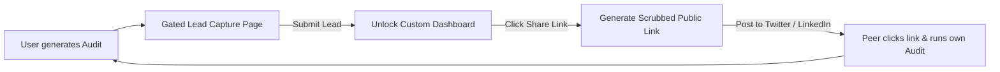

# StackAudit Go-To-Market Strategy 🚀

This document details the GTM playbook, distribution channels, and growth tactics designed to scale StackAudit to its first 1,000 customers.

---

## 🎯 Ideal Target Customer (ICP)

Our primary target is **Early-stage tech startups (Pre-seed to Series A)** and **Boutique agencies** with 5 to 50 team members.

### Key Demographics
- **Title**: CTO, Head of Engineering, Founder, or Ops Manager.
- **Characteristics**: Fast-growing development teams, heavy reliance on multiple AI tools (Cursor, Copilot, ChatGPT, Claude, OpenAI API), and a mandate from investors to reduce cash burn.

### Pain Points
* **Shadow AI Spend**: Individual developers signing up for Pro accounts on personal credit cards and submitting expense reports.
* **Subscription Redundancies**: Paying for GitHub Copilot licenses while simultaneously paying for Cursor Pro for the same developers.
* **API Waste**: Engineers using expensive GPT-4o keys for basic automated testing where a model like GPT-4o-mini is 90% cheaper.

---

## 🚀 The Launch Strategy

### 1. Product Hunt Launch Playbook
- **Teaser Campaign**: Post a "coming soon" landing page on Product Hunt 2 weeks before launch to accumulate initial subscribers.
- **The Hook**: Launch with a free "Instant AI Spend Audit" tool (takes < 2 minutes, no sign-up required to see initial metrics).
- **Target Metrics**: 400+ upvotes, top 5 product of the day to get featured in the Product Hunt newsletter.

### 2. Reddit Distribution
- **Target Subreddits**: `r/startup`, `r/saas`, `r/indiehackers`, `r/developer`.
- **Methodology**: Do not post direct pitch links. Instead, post a detailed post-mortem: *"How I analyzed our team's AI tool spend and cut $450/month in 10 minutes (with math and recommendations)."* 
- In the comments, share the StackAudit link organically when users ask how they can replicate the process.

### 3. Twitter/X Organic Growth Loop
- Share screenshots of the dashboard showing actual reports (with company names blurred).
- Run threads analyzing the pricing structures of main AI providers (e.g. *"Why you are overpaying for Cursor Business if your team is under 5 people — A thread."*).

---

## 🔁 The Virality Loop

To drive word-of-mouth growth, StackAudit embeds a sharing mechanism:

### The "Scrubbed Sharing" Feature
When a user shares their report, StackAudit dynamically generates a unique public URL. The page displays the savings but automatically scrubs the founder's email and company name. This allows founders to brag about their cost-cutting achievements on Twitter/X or LinkedIn without exposing confidential corporate metrics.

---

## 📈 Initial SEO Opportunities

We will build static, programmatically generated comparison pages targeting high-intent long-tail keywords:

1. **Category Comparison Keywords**:
   - `Cursor vs GitHub Copilot pricing calculator`
   - `Claude Team plan vs ChatGPT Team plan savings`
2. **"How-to" Informational Content**:
   - `How to audit startup AI API spend`
   - `How to reduce OpenAI API monthly costs`

---

## 📊 Phase 1 GTM Metrics Goals

* **Target (Month 1)**:
  - 2,500 total audits run.
  - 15% conversion from visitor to completed audit.
  - 25% conversion from audit completion to lead capture (email unlock).
  - **First 100 Qualified Leads** delivered to pipeline.
